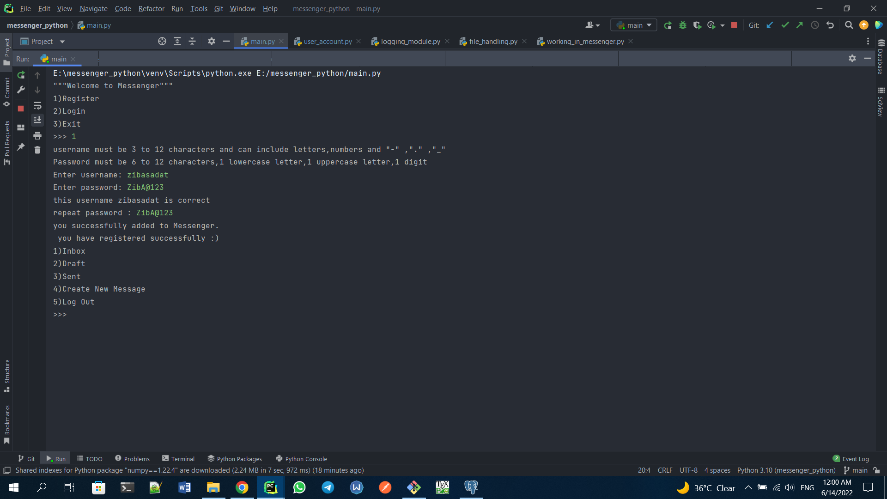
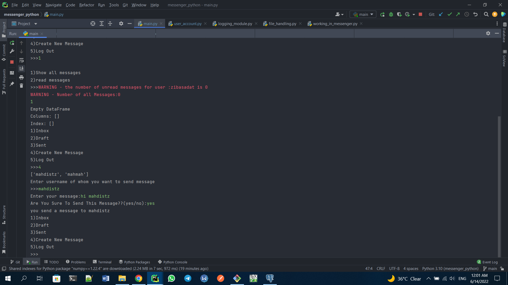
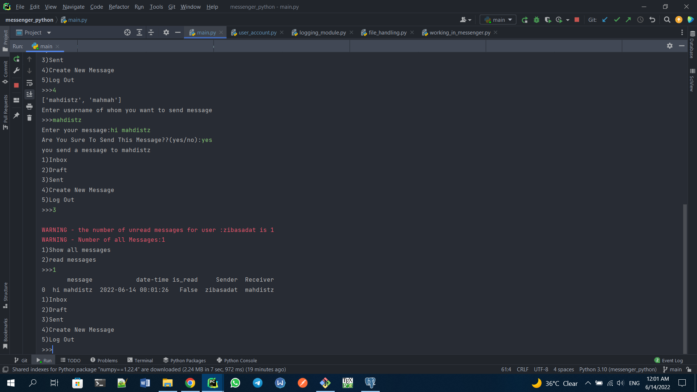
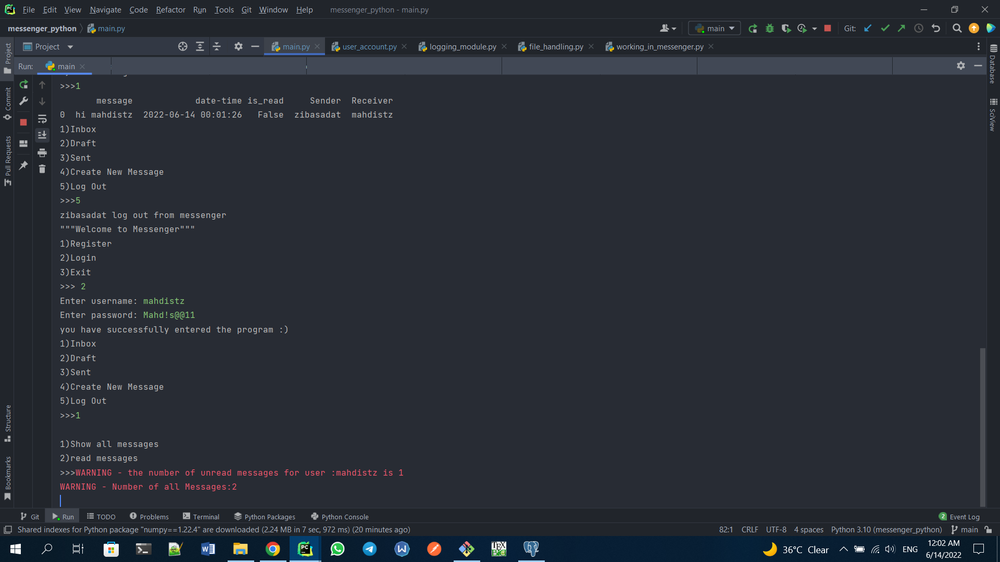
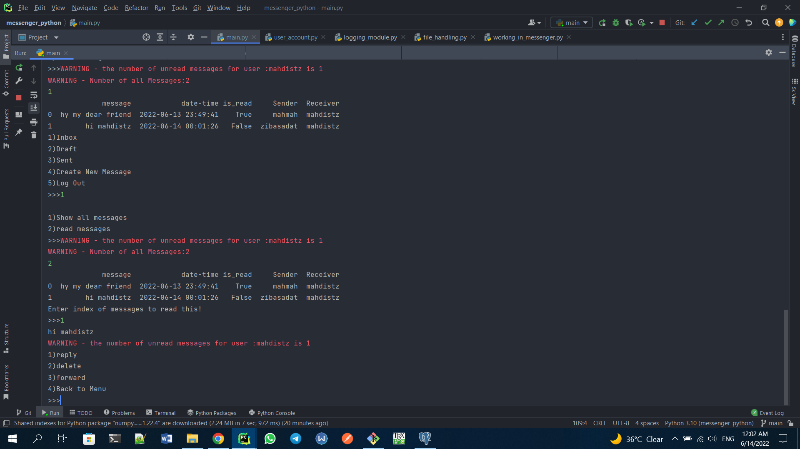
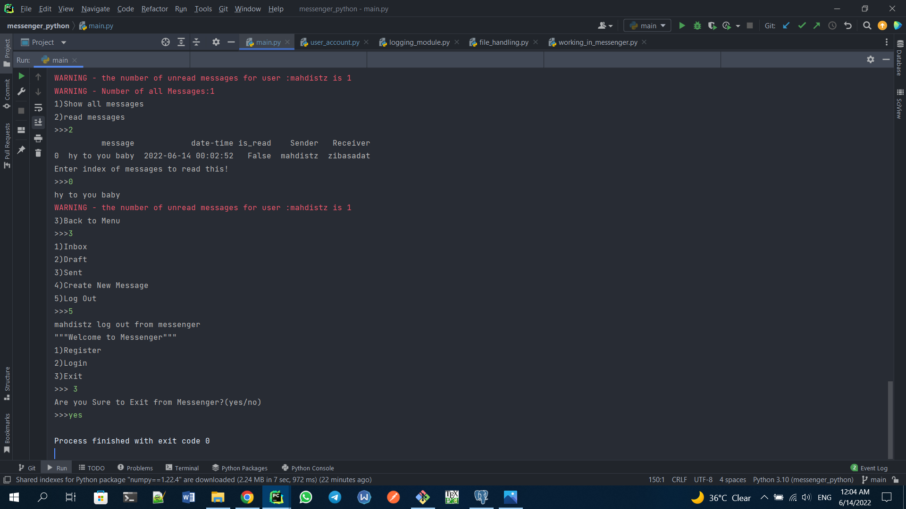

# python_project

***messenger in python console - work with csv files and pandas***

**First clone this repo : git clone https://github.com/mahdistz/messenger_python**

**then Create a virtual environment and active it.**

**pip intall -r requirements.txt**

**then run main.py .**

